# ORTHOSCOPE

<table width="200" border="0">
  <tr>
    <td>ORTHOSCOPE (Inoue and Satoh 2019) identifies orthogroups of specific protein-coding genes within major bilaterian lineages. <br>
orthogroup: a set of genes descended from a single gene in the last common ancestor of all the species being considered (Emms  and Kelly (2015). <br><br>
To delineate orthogroup, ORTHOSCOPE estimates gene trees using DNA or amino acid sequences collected by BLAST search. ORTHOSCOPE allows users to employ several sequences of a specific molecule and broadly accepted nodes included in a user-specified species tree as queries and to evaluate the reliability of estimated orthogroups based on topologies and node support values of estimated gene trees.</td>
  </tr>
  <tbody>
    <tr>
      <td>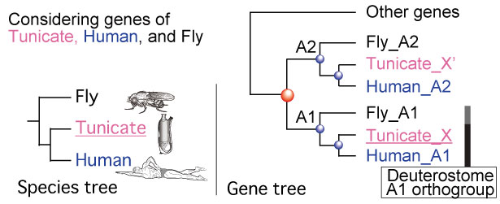</td>
    </tr>
  </tbody>
</table>  

<b>Web servise:</b> [https://orthoscope.jp](https://orthoscope.jp). If this link does not work, please try [https://http://fish-evol.unit.oist.jp/orthoscope/](http://fish-evol.unit.oist.jp/orthoscope/) (8 Jan. 2019).  
<b>Mirror site:</b> [http://www.fish-evol.org/orthoscope/](http://www.fish-evol.org/orthoscope/) (31 May. 2019).
  
<b>Japanese instruction (日本語の説明):</b> [http://www.fish-evol.org/orthoscope_ji.html](http://www.fish-evol.org/orthoscope_ji.html)

---

## Mode
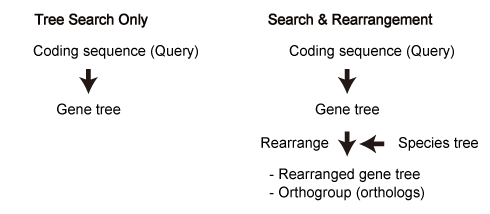

---

## Flow Chart
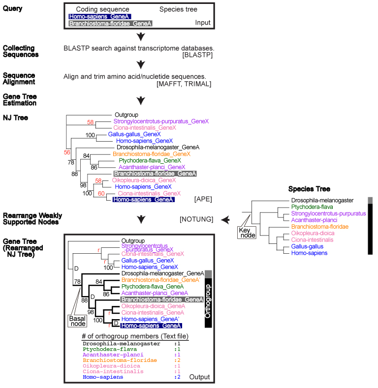

Dependencies:   
[BLAST 2.7.1+](https://blast.ncbi.nlm.nih.gov/Blast.cgi?CMD=Web&PAGE_TYPE=BlastDocs&DOC_TYPE=Download)   
[MAFFT v7.356b](https://mafft.cbrc.jp/alignment/software/)   
[trimAl 1.2rev59](http://www.fish-evol.org/trimAl_ji.html)   
[ape in R, Version5.0](http://ape-package.ird.fr)   
[FastME 2.0](http://www.atgc-montpellier.fr/fastme/) for amino acid analyses   
[Notung-2.9](http://www.cs.cmu.edu/~durand/Notung/)   

## Use of Query Sequences in Gene Tree Estimation   
### Redundant Blast hits are deleted   
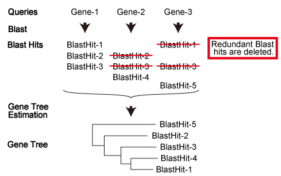

### Queries are added or replaced   
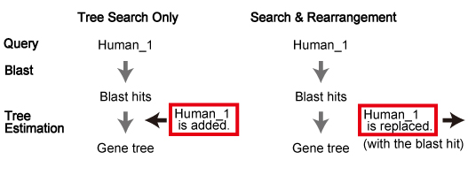

---

## Example Data   
### Inoue et al (2019)   
Inoue J, Nakashima K, and Satoh N. ORTHOSCOPE analysis reveals the presence of the cellulose synthase gene in all tunicate genomes but not in other animal genomes. Genes. 10: 294.   

[Queries](https://github.com/jun-inoue/orthoscope/raw/master/tarfiles/CesA_Satoh19.zip). These sequences were used for "Tree Search Only" mode.   
In this paper, maximum likelihood trees were estimated according to the process described in "Tree Estimation of Orthogroup Members (with Additional Sequences)". See below.   


#   
### Inoue and Satoh (2019)
Inoue J. and Satoh N. 2019. ORTHOSCOPE: an automatic web tool of analytical pipeline for ortholog identification using a species tree. [MBE in press](https://academic.oup.com/mbe/advance-article/doi/10.1093/molbev/msy226/5229933).   

| Actinopterygii | Vertebrata | Deuterostomia | Protostomia |
:---: | :---: | :---: | :---:
| PLCB1* | ALDH1A* | Brachyury | Brachyury |
| [Queries][t1-1] | [Queries][t1-2] | [Queries][t1-3] | [Queries][t1-4] |
| [Result][t1-5] | [Result][t1-6] | [Result][t1-7] | [Result][t1-8] |

[t1-1]:https://github.com/jun-inoue/orthoscope/raw/master/tarfiles/ActinopterygianPLCB1.fas
[t1-2]:https://github.com/jun-inoue/orthoscope/raw/master/tarfiles/VertebrateALDH1A.fas
[t1-3]:https://github.com/jun-inoue/orthoscope/raw/master/tarfiles/DeuterostomeBra.fas
[t1-4]:https://github.com/jun-inoue/orthoscope/raw/master/tarfiles/ProtostomeBra.fas
[t1-5]:https://github.com/jun-inoue/orthoscope/raw/master/tarfiles/ActinopterygianPLCB1.zip
[t1-6]:https://github.com/jun-inoue/orthoscope/raw/master/tarfiles/VertebrateALDH1A.zip
[t1-7]:https://github.com/jun-inoue/orthoscope/raw/master/tarfiles/DeuterostomeBra.zip
[t1-8]:https://github.com/jun-inoue/orthoscope/raw/master/tarfiles/ProtostomeBra.zip


#   
### Downloading query sequences from NCBI/Ensembl
From [NCBI](https://www.ncbi.nlm.nih.gov) or [Ensembl](http://ensembl.org/index.html), query sequences can be downloaded.   
For coding sequneces, please select CDS as follows.

[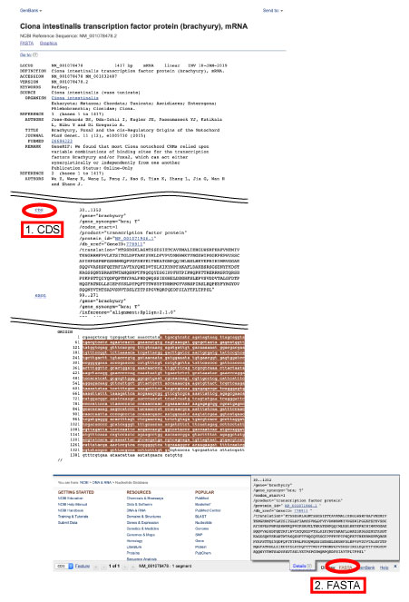](images/CDSselectL.jpg)   


#   
### Collecting Query Sequences from an Assemble Database (Vertebrate ALDH1A and Actinopterygin PLCB1)

1. Download Coregonus lavaretus TSA file ([GFIG00000000.1](https://www.ncbi.nlm.nih.gov/nuccore/GFIG00000000.1)) form NCBI.
2. Translate raw sequences into amino acid and coding sequences using [TransDecoder](https://github.com/TransDecoder/TransDecoder/wiki).
```
./TransDecoder.LongOrfs -t GFIG01.1.fsa_nt
```
3. Make blast databases using [BLAST+](https://blast.ncbi.nlm.nih.gov/Blast.cgi?CMD=Web&PAGE_TYPE=BlastDocs&DOC_TYPE=Download).
```
makeblastdb -in longest_orfs.pep -dbtype prot -parse_seqids 
makeblastdb -in longest_orfs.cds -dbtype nucl -parse_seqids
```
4. BLASTP seaech against amino acid database.
```
blastp -query query.txt -db longest_orfs.pep -num_alignments 10 -evalue 1e-12 -out 010_out.txt
```
5. Retrieve blast top hit sequences from coding sequence file using sequence id.
```
blastdbcmd -db longest_orfs.cds -dbtype nucl -entry_batch queryIDs.txt -out 020_out.txt
```

<br />
<br />

---
## Focal Group


<br />
<br />  

---
## Upload Files
Coding sequence


Case 1: Query seqeunce is present in the ORTHOSCOPE database


Case 2: Query seqeunce is not present in the ORTHOSCOPE database

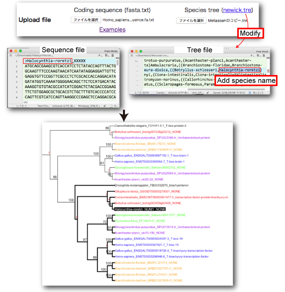

<br />
<br />  

---
## Rooting Selection from Blast Hits

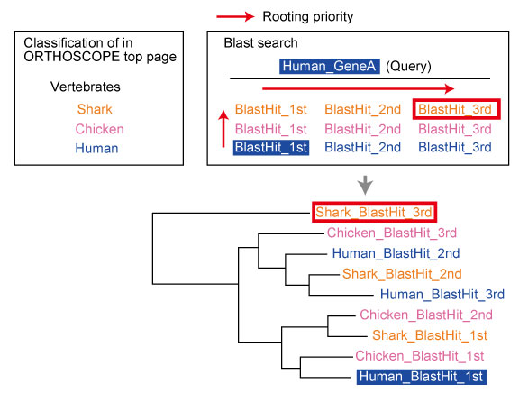

<br />
<br />  

---
## Species Tree Hypothesis

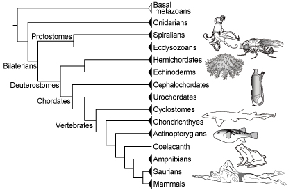

See our [Species_tree](https://github.com/jun-inoue/Species_tree) page.

---
## Sequence Collection
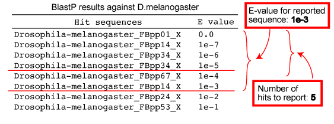

<br />
<br />  

---
## Aligned Site Rate
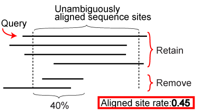

<br />
<br />  

---
## Tree Search
Dataset

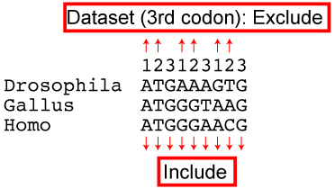

<br />
Rearrangement BS value threshold 


NJ analysis is conducted using the software package [Ape](https://cran.r-project.org/web/packages/ape/ape.pdf) in R (coding) and [FastME](http://www.atgc-montpellier.fr/fastme/) (amino acid). Rearrangement analysis is done using a method implemented in [NOTUNG](http://www.cs.cmu.edu/~durand/Notung/).

<br />
<br />  

---
## Genome Taxon Sampling

Feasibility of completion

Number of hits to report per genome | Number of species
:---: | :---:
3 | <50
5 | <40 
10 | <30 

<br />
<br />  

---
## Tree Estimation of Orthogroup Members (with Additional Sequences)
By using sequences of ORTHOSCOPE results, the analysis can be done on your own computer.  
I made an analysis pipeline for this 2nd step. The script is specialized for a Macintosh use with Python 3. Windows users need some modifications.  
Analysis pipeline with example data: [DeuterostomeBra_2ndAnalysis.zip](https://github.com/jun-inoue/orthoscope/raw/master/tarfiles/DeuterostomeBra_2ndAnalysis.zip).

### Installing Dependencies

Estimation of the 2nd tree by the downloaded pipeline requires some dependencies to be installed and in the system path in your computer.
<br />  


#### RAxML:

Available here: [https://github.com/stamatak/standard-RAxML](https://github.com/stamatak/standard-RAxML)

Download the the latest release and extract it.
Cd into the extracted directry (e.g., standard-RAxML-8.2.12), compile the PThreads version, and copy the executable to a directory in your system path, e.g.:
```
cd standard-RAxML-8.2.12
make -f Makefile.SSE3.PTHREADS.gcc
cp raxmlHPC-PTHREADS-SSE3 ~/bin
```
Add the address to your PATH. For example:
```
export PATH=$PATH:~/bin
``` 
<br />  

#### Mafft v7.407:
Available here: [https://mafft.cbrc.jp/alignment/software/](https://mafft.cbrc.jp/alignment/software/).  
After compilation, set your PATH following [this site](https://mafft.cbrc.jp/alignment/software/add_path.html).  

<br />   


#### trimAl v1.2 (Official release):
Available here: [http://trimal.cgenomics.org/downloads](http://trimal.cgenomics.org/downloads).  
Cd to trimAl/source, type make, and copy the executable.
```
make
cp trimal ~/bin
```  
<br />  


#### pal2nal.v14: 
Available here: [http://www.bork.embl.de/pal2nal/#Download](http://www.bork.embl.de/pal2nal/#Download).  
Change the permission of perl script and copy it.
```
chmod 755 pal2nal.pl
cp pal2nal.pl ~/bin
```  
<br />  


#### Ape in R:
R (3.5.2) is available from [here](https://cran.ism.ac.jp).  
By installing R, [rscript](https://stat.ethz.ch/R-manual/R-devel/library/utils/html/Rscript.html) will be installed automatically.  
[APE in R](http://ape-package.ird.fr) can be installed from the R console as follows:
```
install.packages("ape")
```
<br />
<br />  

### Tree Estimation

Using the downloaded pipeline, the 2nd gene trees will be estimated as follows:
- Based on the estimated rearranged NJ tree, users should select coding sequences of orthogroup and outgroups manually. Then the pipeline can start subsequent analyese.
- Selected sequences are aligned using MAFFT (Katoh et al. 2005). 
- Multiple sequence alignments are trimmed by removing poorly aligned regions using TRIMAL 1.2 (Capella-Gutierrez et al. 2009) with the option “gappyout.” 
- Corresponding cDNA sequences are forced onto the amino acid alignment using PAL2NAL (Suyama et al. 2006) to generate nucleotide alignments. 
- Phylogenetic analysis is performed with RAxML 8.2.4 (Stamatakis et al. 2014), which invokes a rapid bootstrap analysis and searches for the best-scoring ML tree with the GTRGAMMA (Yang 1994a, 1994b) or GTRCAT model. 

The actual rocess is as follows:   

1. Decompress DeuterostomeBra_2ndAnalysis.zip. Open DeuterostomeBra_2ndAnalysis file and decompress 100_2ndTree.tar.gz file.

2. Select an appropriate outgroup and orthogroup members and save 010_candidates_nucl.txt file. The outgroup sequence should be placed at the top of alignment. Additional sequences can be included.

[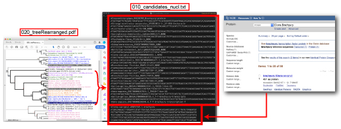](images/treeSearchWithOrthologs2L.jpg)

3. Cd into 100_2ndTree directory.
4. Run the pipeline.
```
./100_estimate2ndTree.py
```
5. ML tree is saved in 200_RAxMLtree_Exc3rd.pdf automatically.

[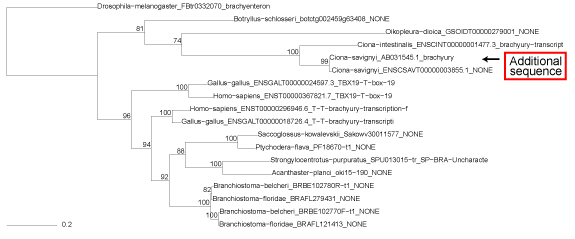](images/200_RAxMLtree_Exc3rdL.jpg)

<br />  


### Duplicated Node Estimation
Using [Notung](http://www.cs.cmu.edu/~durand/Notung/), duplicated nodes can be identified. Here, we will analyze the gene tree of orthogroup members.

1. Double click the downloaded .jar file (here, Notung-2.9.jar).  
2. Save the species tree (newick format) as a new file (here, speciesTree.tre), from 000_summary.txt file.  
3. Open the species tree file, speciesTree.tre (File > Open Gene Tree), from Notung.  
4. Open the gene tree file, RAxML_bootstrap.txt (File > Open Gene Tree).  
5. Set "Edge Weight THreshold" (here 70) from “Edit Values button“. This value corresponds to
“Rearrangement BS value threshold” in ORTHOSCOPE.  
6. From "Rearrange" tab in the bottum, select "Prefix of the general label".  
7. Push "Reconcile" button.  
8. Duplicated nodes are shown with "D".  

[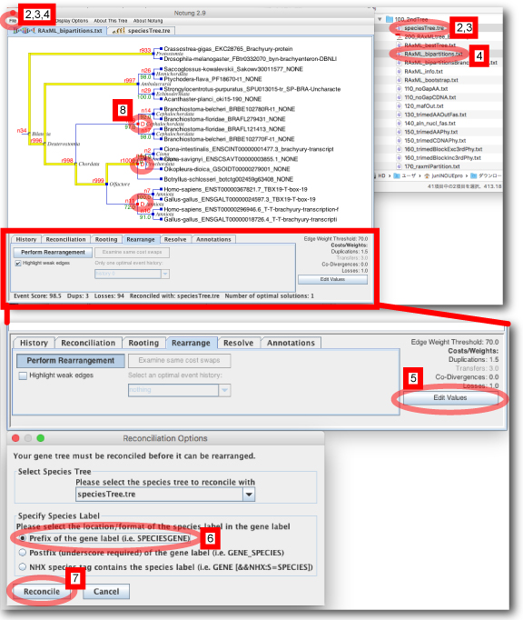](images/Notung_rearrangement1L.jpg)

<br />
<br />  
 


---
## Supported Browsers
Chrome | Firefox | Safari | IE
:---: | :---: | :---: | :---:
Supported | Supported | 11.0 or later | Not supported
<br />
<br />  

---
## History

Date | Version | Revision
--- | --- | ---
6 Nov. 2019 |  | [ORTHOSCOPE-Mammalia](https://www.orthoscope.jp/Mammalia.html) was newly created and Data of 46 mammals were newly added.
2 Oct. 2019 |  | Data of Pacific white shrimp (Penaeus vannamei) were newly added.
5 Sep. 2019 |  | Data of 2 molluscs (Octopus vulgaris, Pomacea canaliculata) were newly added.
21 Aug. 2019 |  | Column of Seqs (# of sequence in each gene model) was added.
21 Aug. 2019 |  | Data of 6 actinopterygians (Erpetoichthys calabaricus, Denticeps clupeoides, Carassius auratus, Electrophorus electricus,Tachysurus fulvidraco, Pangasianodon hypophthalmus), 2 amphibians (Rhinatrema bivittatum, Microcaecilia unicolor), and 3 lepidosaurians (Notechis scutatus, Podarcis muralis, Pseudonaja textilis) were newly added.
19 Apr. 2019 |  | Nagative branch lengths are replaced with 0 in the tree drawing (R script). Gene_tree$edge.length[Gene_tree$edge.length<0]<-0
25 Jan. 2019 | [Version 1.0.2](http://fish-evol.unit.oist.jp/orthoscope/) | Released. For Inoue et al. 2019, Data of Archaea, Plants, Bacteria, and Urochordata were newly added.
21 Dec. 2018 | [Version 1.0.1](http://fish-evol.unit.oist.jp/orthoscope101/) | Released. In the rearranged gene tree, nodes identified as speciation events were marked with "D".
18 Dec. 2018 | Version 1.0.1.beta | Xenacoelomorph, platyhelminth, priapulid, avian data were newly added.
10 July 2018 | [Version 1.0](http://fish-evol.unit.oist.jp/orthoscope100) | Published in Inoue and Satoh (2018).

<br />
<br />  

---
## Gene Model Databases Used in ORTHOSCOPE
Gene model databases (fasta files of amino acid and coding sequences) can be downloaded from [zenodo](https://zenodo.org/record/2553737#.XFLGVS3AMvp) (10.5281/zenodo.2553737). 6 Oct. 2019.    

ORTHOSCOPE employs a genome-scale protein-coding gene database (coding and amino acid sequence datasets) constructed for each species. In order to count numbers of orthologs in each species, only the longest sequence is used when transcript variants exist for single locus.
<br />
<br />  

---
## Papers using ORTHOSCOPE
Ishikawa, A, Kabeya, N, Ikeya, K, Kakioka, R, Cech, JN, Osada, N, Leal, MC, Inoue J, Kume, M, Toyoda, A, Tezuka, A, Nagano, AJ, Yamasaki, YY, Suzuki, Y, Kokita, T, Takahashi, H, Lucek, K, Marques, D, Takehana, Y, Naruse, K, Mori, S, Monroig, O, Ladd, N, Schubert, C, Matthews, B, Peichel, CL, Seehausen, O, Yoshizaki, G, Kitano J. 2019.
A key metabolic gene for recurrent freshwater colonization and radiation in fishes
Science, 364: 886-9. [Link](https://science.sciencemag.org/content/364/6443/886).
<blockquote>
ORTHOSCOPE was used to count the number of Fads2 gene in 48 actinopterygians.
</blockquote>
<br />

Inoue J, Nakashima K, Satoh, N. 2019.
ORTHOSCOPE analysis reveals the presence of the cellulose synthase gene in all tunicate genomes but not in other animal genomes. Genes. 10: 294. [Link](https://www.mdpi.com/2073-4425/10/4/294)
<blockquote>
ORTHOSCOPE was used to confirm the absence of CesA gene in protostomes and basal deuterostomes.
</blockquote>
<br />

Shiraishi A, Okuda T, Miyasaka N, Osugi T, Okuno Y, Inoue J, and Satake H. 2019.
Repertoires of G protein-coupled receptors for Ciona-specific neuropeptides. Proceedings of the National Academy of Sciences of the United States of America.  116: 7847-7856. [Link](https://www.pnas.org/content/early/2019/03/28/1816640116)
<blockquote>
ORTHOSCOPE was used to reconstruct deuterostome gene trees of G protein-coupled receptors.
</blockquote>
<br />

Inoue J, Satoh N. 2018.
Deuterostome genomics: Lineage-specific protein expansions that enabled chordate muscle evolution. Molecular Biology and Evolution. 35(4):914-924.　[Link](https://academic.oup.com/mbe/article/35/4/914/4793229)
<blockquote>
The pipeline implemented in ORTHOSCOPE was used to evaluate the presence or absence of genes coding for structural-muscle proteins.
</blockquote>
<br />

Inoue J, Yasuoka Y, Takahashi H, Satoh N. 2017.
The chordate ancestor possessed a single copy of the Brachyury gene for notochord acquisition. Zoological Letters. 3: 4.　[Link](https://zoologicalletters.biomedcentral.com/articles/10.1186/s40851-017-0064-9)
<blockquote>
  The pieline implemented in ORTHOSCOPE was used to count the number of Brachury gene in 5 deuterostome lineages.  
</blockquote> 

<br />
<br />  

---
## Citation
Inoue J. and Satoh N. ORTHOSCOPE: An automatic web tool for phylogenetically inferring bilaterian orthogroups with user-selected taxa. Molecular Biology and Evolution, 36, 621–631. [Link](https://academic.oup.com/mbe/advance-article/doi/10.1093/molbev/msy226/5229933).

---
## Previous versions: 
[Ver.1.0.1](http://fish-evol.unit.oist.jp/orthoscope101/)

Email: [_jun.inoue_ AT _oist.jp_](http://www.geocities.jp/ancientfishtree/index_eng.html)
