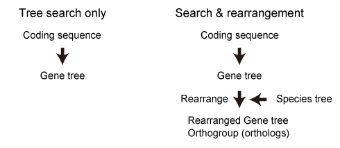
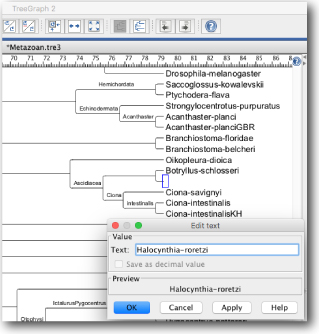
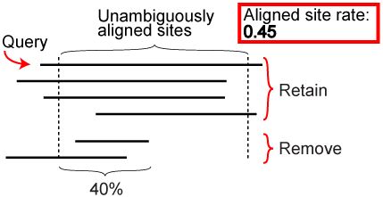
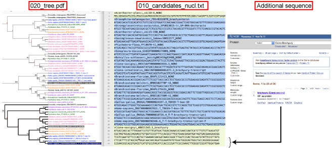

# ORTHOSCOPE
Our web servise is available from 
https://fish-evol.unit.oist.jp/orthoscope.

---

## Mode


---

## Case studies in Inoue and Satoh (submitted).
Query seqeunces from genes with known function.

| Actinopterygii | Vertebrata | Deuterostomia | Protostomia |
:---: | :---: | :---: | :---:
| PLCB1* | ALDH1A* | Brachyury | Brachyury |
| [Queries][t1-1] | [Queries][t1-2] | [Queries][t1-3] | [Queries][t1-4] |
| [Result][t1-5] | [Result][t1-6] | [Result][t1-7] | [Result][t1-8] |

[t1-1]:https://github.com/jun-inoue/orthoscope/raw/master/tarfiles/ActinopterygianPLCB1.fas
[t1-2]:https://github.com/jun-inoue/orthoscope/raw/master/tarfiles/VertebrateALDH1A.fas
[t1-3]:https://github.com/jun-inoue/orthoscope/raw/master/tarfiles/DeuterostomeBra.fas
[t1-4]:https://github.com/jun-inoue/orthoscope/raw/master/tarfiles/ProtostomeBra.fas
[t1-5]:https://github.com/jun-inoue/orthoscope/raw/master/tarfiles/ActinopterygianPLCB1.zip
[t1-6]:https://github.com/jun-inoue/orthoscope/raw/master/tarfiles/VertebrateALDH1A.zip
[t1-7]:https://github.com/jun-inoue/orthoscope/raw/master/tarfiles/DeuterostomeBra.zip
[t1-8]:https://github.com/jun-inoue/orthoscope/raw/master/tarfiles/ProtostomeBra.zip

#         
Query sequence collectoin from assemble database*

1. Download Coregonus lavaretus TSA file ([GFIG00000000.1](https://www.ncbi.nlm.nih.gov/nuccore/GFIG00000000.1)) form NCBI.
2. Translate raw sequences into amino acid and coding sequences using [TransDecoder](https://github.com/TransDecoder/TransDecoder/wiki).
```
./TransDecoder.LongOrfs -t GFIG01.1.fsa_nt
```
3. Make blast databases using [BLAST+](https://blast.ncbi.nlm.nih.gov/Blast.cgi?CMD=Web&PAGE_TYPE=BlastDocs&DOC_TYPE=Download).
```
makeblastdb -in longest_orfs.pep -dbtype prot -parse_seqids 
makeblastdb -in longest_orfs.cds -dbtype nucl -parse_seqids
```
4. BLASTP seaech against amino acid database.
```
blastp -query query.txt -db longest_orfs.pep -num_alignments 10 -evalue 1e-12 -out 010_out.txt
```
5. Retrieve blast top hit sequences from coding sequence file using sequence id.
```
blastdbcmd -db longest_orfs.cds -dbtype nucl -entry_batch queryIDs.txt -out 020_out.txt
```

<br />

---
## Analysis group


---
## Upload files
Coding sequence


Case 1: Query seqeunce is present in the ORTHOSCOPE database


Case 2: Query seqeunce is not present in the ORTHOSCOPE database


---
## Species tree hypothesis

Our hypothetical species tree can be downloaded from [here](https://fish-evol.unit.oist.jp/orthoscope/examples/SpeciesTreeHypothesis.tre).

The tree file can be modifed using [TreeGraph2](http://treegraph.bioinfweb.info/).



---
## Sequence collection


---
## Alignment


---
## Tree search
Dataset


<br />
Rearrangement BS value threshold 


NJ analysis is conducted using the software package [Ape](https://cran.r-project.org/web/packages/ape/ape.pdf) in R (coding) and [FastME](http://www.atgc-montpellier.fr/fastme/) (amino acid). Rearrangement analysis is done using a method implemented in [NOTUNG](http://www.cs.cmu.edu/~durand/Notung/).

---
## Tree estimation of orthologs using additional sequence
The script is specialized for a Macintosh use. Windows users need some modifications.
[Example](images/DeuterostomeBra_2ndAnalysis.zip).
1. Select only orthologs and save 010_candidates_nucl.txt file with additional sequence.

[[](images/treeSearchWithOrthologsL.jpg)

2. Decompress 100_2ndTree.tar.gz file
3. cd into 100_2ndTree file
4. Run the pipeline
```
./100_estimate2ndTree.py
```
5. ML tree is saved in 200_RAxMLtree_Exc3rd.pdf.


---
## Supported browsers
Chrome | Firefox | Safari | IE
:---: | :---: | :---: | :---:
Supported | Supported | 11.0 or later | Not supported

---
## History
10 July 2018 	Version 1.0.

---
## Database
Available from [here](https://zenodo.org/record/1327268#.W2e9VS09wo8)
(10.5281/zenodo.1327268)

---
## Citation
Inoue J. and Satoh N. ORTHOSCOPE: an automatic web tool of analytical pipeline for ortholog identification using a species tree. in prep.

---
Previous versions: 


Email: [_jun.inoue_ AT _oist.jp_](http://www.geocities.jp/ancientfishtree/index_eng.html)
