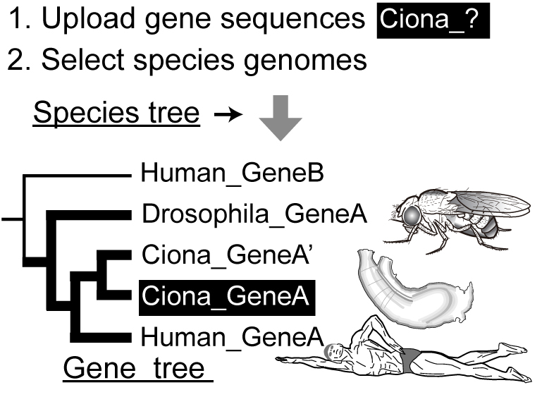

# ORTHOSCOPE

<!-- 
## NEWS
Mirror viento has been accidentally stopped on 19 Jan 2024 morning. Please use Mirror Osaka until recovery of viento.
-->

## Web Servers for Online Analysis
yurai (fast)   
[http://yurai.aori.u-tokyo.ac.jp/orthoscope/Deuterostomia.html](http://yurai.aori.u-tokyo.ac.jp/orthoscope/Deuterostomia.html)    
<!-- 
viento (mediam)   
[https://orthoscope.jp/orthoscope/Deuterostomia.html](https://orthoscope.jp/orthoscope/Deuterostomia.html)   
 This server will close soon (1 Feb 2025)   
-->

osaka2 (slow)   
[http://49.212.178.185/orthoscope/Deuterostomia.html](http://49.212.178.185/orthoscope/Deuterostomia.html)

---
## Instruction　　　
[https://fish-evol.org/orthoscope_instruction/index.html](https://fish-evol.org/orthoscope_instruction/index.html)   

---

## Abstract

ORTHOSCOPE (https://academic.oup.com/mbe/article/36/3/621/5229933) is a web tool to identify orthogroup members (orthologs and paralogs; see below) of a specific protein‑coding gene of animals and plants.

By uploading gene sequences of interest and selecting species genomes from more than 600 animals and plants, users can infer their functions and copy numbers according to gene‑tree‑based results.

Using sequences collected by BLAST search, ORTHOSCOPE estimates the gene tree, compares it with the https://github.com/jun-inoue/Species_tree, and identifies an orthogroup.

ORTHOSCOPE works only for a specific gene and does not allow genome‑scale analyses.  
A downloadable genome‑wide pipeline is available as https://github.com/jun-inoue/ORTHOSCOPE_STAR.

---
## Contact 
Email: [_jinoueATg.ecc.u-tokyo.ac.jp_](http://www.fish-evol.org/index_eng.html)
